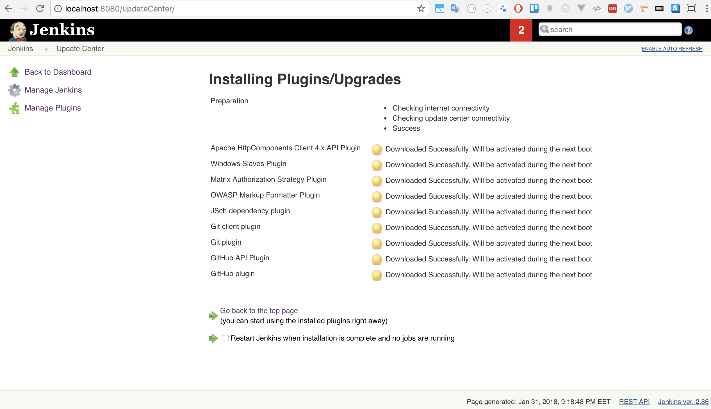

# Project overview 

+ Bank credit account management
+ 2 service: User & Account 

### Tech stack 
+ Service discovery : Eureka 
    + Client-side discovery pattern: Network location + load balancing algorithm : Eureka - Ribbon: load balancing 
    + Server-side discovery : middleware entity - Load balancer - gateway - API gateway pattern 

+ Circuit breaker 
    + Close state 
    + Open state 
    + Half open state 

+ RabbitMQ : message broker solutions AMQP 
    + Start RabbitMQ server: `rabbitmq-server start`
    + Admin console, install RabbitMQ plugin: `sudo rabbitmq-plugins enable rabbitmq_management `
    + `http://localhost:15672/#/` 

+ Jenkins standalone : 
    + Install Jenkins 
    + `http://localhost:8080`
    + Install Jenkins plugin : Git and Github plugin 
    + Create Maven job for build 
+ Docker 
    + Build Docker image : 
    + Push Docker to Docker hub 
        + Use spotify plugin to run Docker file to create image 
        <pluginManagement> 
            <plugins> 
                <plugin> 
                    <groupId>com.spotify</groupId> 
                    <artifactId>docker-maven-plugin</artifactId> 
                    <version>0.4.11</version> 
                    <executions> 
                        <execution> 
                            <phase>package</phase> 
                            <goals> 
                                <goal>build</goal> 
                            </goals> 
                        </execution> 
                    </executions> 
                    <configuration> 
                        <dockerDirectory>${project.build.directory}/classes</dockerDirectory> 
                        <!--push to docker hub -->
                        <imageName>cr-ri/${project.artifactId}</imageName> 
                        <resources> 
                            <resource> 
                                <targetPath>/</targetPath> 
                                <directory>${project.basedir}</directory> 
                                <excludes> 
                                    <exclude>target/**/*</exclude> 
                                    <exclude>pom.xml</exclude> 
                                    <exclude>*.iml</exclude> 
                                </excludes> 
                            </resource> 
                            <rescource> 
                                <targetPath>/</targetPath> 
                                <directory>${project.build.directory}</directory> 
                                <include>webgate.war</include> 
                            </rescource> 
                        </resources> 
                    </configuration> 
                </plugin> 
            </plugins> 
        </pluginManagement> 

        + Command to build the Docker image : 
            + `mvn package docker:build `
            + Push to Docker registry : `mvn package docker:build -DpushImage`

+ CI tool: 
    + Set up Jenkins master-slave 
    + Create job on Jenkins which have a build trigger as github commit
    + Job shell script: 
        `
        #!/bin/bash
        # build docker image
        docker build --pull=true -t <git-repo>:$git_commit
        # test docker image 
        docker run -i --rm <git-repo>:$git_commit ./script/tests
        # push docker image
        docker push <git-repo>:$git_commit
        `

+ Monitoring microservice project : AWS Cloudwatch, 

### Run the project 
+ Maven 
+ Java 8 
+ MySQL 
+ Start Config server 
    + `http://localhost:8888/config-server/financialService`
    + `http://localhost:8888/config-server/userService`
    + `http://localhost:8888/userService/default`

+ API endpoint 
    + User service 
        Post http://localhost:8081/api/users/<user_Id> 
        Post http://localhost:8081/api/users/<user_Id>/address 
        Get Post http://localhost:8081/api/users/<user_Id> 
        Get Post http://localhost:8081/api/users/<user_Id>/address 
        Delete Post http://localhost:8081/api/users/<user_Id> 
    + Body request : 
        + Address:
        { 
  "userId": "93a52ce4-9331-43b5-8b56-09bd62cb0444", 
  "city": "New York", 
  "addressLine1": "4719 Fermun Road", 
  "addressLine2": "Yorktown Heights", 
  "pinCode": "10004" 
} 

        + User: 
        { 
"userId": "93a52ce4-9331-43b5-8b56-09bd62cb0444", 
  "firstName": "John", 
  "lastName": "Montgomery", 
  "middleName": "Allen", 
  "legalId": "B053-62-64087", 
  "gender": "1", 
  "dateOfBirth": "2010-10-27T11:58:22.973Z", 
} 

    + Financial Service API 
        + POST  http://localhost:8090/PM/finance/<user Id>/obligation  
        + POST  http://localhost:8090/PM/finance/93a52ce4-9331-43b5-8b56-09bd62cb0444/obligation  
        + POST http://localhost:8090/PM/finance/<user Id>account 
        + POST http://localhost:8090/PM/finance/93a52ce4-9331-43b5-8b56-09bd62cb0444/account 
        + GET http://localhost:8090/PM/finance/93a52ce4-9331-43b5-8b56-09bd62cb0444/obligation  
        + Response: {
"id": 1, 
"user_id":"3a52ce4-9331-43b5-8b56-09bd62cb0444", 
"monthlyIncome":150000, 
"monthlyemi":50000, 
"monthlySpending":50000, 
"createdOn":"1483209000000", 
"deletedOn":null 
} 

### Screen shot demos 

