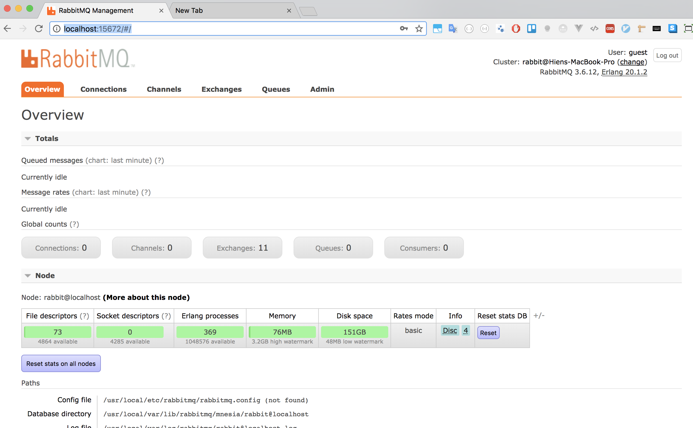

# Project overview 

### Tech stack 
+ Service discovery : Eureka 
    + Client-side discovery pattern: Network location + load balancing algorithm : Eureka - Ribbon: load balancing 
    + Server-side discovery : middleware entity - Load balancer - gateway - API gateway pattern 

+ Circuit breaker 
    + Close state 
    + Open state 
    + Half open state 

+ RabbitMQ : message broker solutions AMQP 
    + Start RabbitMQ server: `rabbitmq-server start`
    + Admin console, install RabbitMQ plugin: `sudo rabbitmq-plugins enable rabbitmq_management `
    + `http://localhost:15672/#/` 

+ Jenkins standalone : 
    + Install Jenkins 
    + `http://localhost:8080`
    + Install Jenkins plugin : Git and Github plugin 

### Run the project 
+ Maven 
+ Java 8 
+ MySQL 
+ Start Config server 
    + `http://localhost:8888/config-server/financialService`
    + `http://localhost:8888/config-server/userService`
    + `http://localhost:8888/userService/default`

+ API endpoint 
    + User service 
        Post http://localhost:8081/api/users/<user_Id> 
        Post http://localhost:8081/api/users/<user_Id>/address 
        Get Post http://localhost:8081/api/users/<user_Id> 
        Get Post http://localhost:8081/api/users/<user_Id>/address 
        Delete Post http://localhost:8081/api/users/<user_Id> 
    + Body request : 
        + Address:
        { 
  "userId": "93a52ce4-9331-43b5-8b56-09bd62cb0444", 
  "city": "New York", 
  "addressLine1": "4719 Fermun Road", 
  "addressLine2": "Yorktown Heights", 
  "pinCode": "10004" 
} 

        + User: 
        { 
"userId": "93a52ce4-9331-43b5-8b56-09bd62cb0444", 
  "firstName": "John", 
  "lastName": "Montgomery", 
  "middleName": "Allen", 
  "legalId": "B053-62-64087", 
  "gender": "1", 
  "dateOfBirth": "2010-10-27T11:58:22.973Z", 
} 

    + Financial Service API 
        + POST  http://localhost:8090/PM/finance/<user Id>/obligation  
        + POST  http://localhost:8090/PM/finance/93a52ce4-9331-43b5-8b56-09bd62cb0444/obligation  
        + POST http://localhost:8090/PM/finance/<user Id>account 
        + POST http://localhost:8090/PM/finance/93a52ce4-9331-43b5-8b56-09bd62cb0444/account 
        + GET http://localhost:8090/PM/finance/93a52ce4-9331-43b5-8b56-09bd62cb0444/obligation  
        + Response: {
"id": 1, 
"user_id":"3a52ce4-9331-43b5-8b56-09bd62cb0444", 
"monthlyIncome":150000, 
"monthlyemi":50000, 
"monthlySpending":50000, 
"createdOn":"1483209000000", 
"deletedOn":null 
} 

### Screen shot demos 
